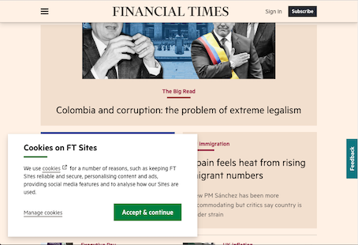

# Give My Head Peace

A Firefox Add-In to remove any HTML elements with 'fixed' or 'static' positioning.

Every website you visit these days has design elements which 'float' above the regular content, displaying menu bars, cookie management options, feedback buttons, toolbars and the like.

Often when you visit a page you don't care about any of that, and you end up having to click some of these items to get them to go away, or maybe just live with the reduced screen real-estate and additional clutter.

So it goes from this:

to this:

## How to Use

With this add-in extension for Firefox, there will be a little broom icon beside Firefox's address bar: .  Simply click it, and all the floating elements on the page will disappear.  The effect is temporary - you can simply reload the page (press F5 or click the  button to get them back again.

----------------------------

Broom icon is licensed under the [Creative Commons](https://en.wikipedia.org/wiki/en:Creative_Commons) [CC0 1.0 Universal Public Domain Dedication](https://creativecommons.org/publicdomain/zero/1.0/deed.en), made available by [nicubunu, via Wikimedia Commons](https://commons.wikimedia.org/wiki/File:Broom.svg)
